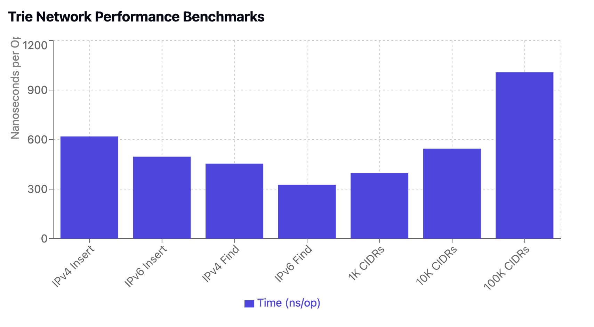

# IP Trie

A high-performance IP prefix map implementation in Go supporting both IPv4 and IPv6 addresses. This library provides efficient CIDR-based IP lookups with metadata storage capabilities.

## Features

- Fast IP lookups (IPv4: ~242ns, IPv6: ~645ns)
- Support for both IPv4 and IPv6 addresses
- CIDR subnet matching
- Metadata storage for each prefix
- Overlapping prefix support
- Zero-allocation lookups
- Comprehensive test suite
- Production-ready performance

## Installation

```bash
go get github.com/metajar/trie-network
```

## Quick Start

```go
package main

import (
    "fmt"
    iptrie "github.com/metajar/trie-network/pkg/trie"
)

func main() {
    // Create a new IP Trie
    trie := iptrie.NewIPTrie()

    // Insert a CIDR with metadata
    metadata := map[string]interface{}{
        "region": "us-west",
        "environment": "production",
        "tags": []string{"edge", "public"},
    }
    
    err := trie.Insert("192.168.1.0/24", metadata)
    if err != nil {
        panic(err)
    }

    // Look up an IP address
    cidr, meta, err := trie.Find("192.168.1.100")
    if err != nil {
        panic(err)
    }

    fmt.Printf("Found IP in CIDR: %s\n", cidr)
    fmt.Printf("Metadata: %v\n", meta)

    // Find all matching prefixes (handles overlapping ranges)
    matches, err := trie.FindAll("192.168.1.100")
    if err != nil {
        panic(err)
    }

    for _, match := range matches {
        fmt.Printf("Matching CIDR: %s, Metadata: %v\n", match.CIDR, match.Metadata)
    }
}
```

## API Reference

### Creating a New Trie

```go
trie := iptrie.NewIPTrie()
```

### Inserting a CIDR

```go
err := trie.Insert("192.168.1.0/24", map[string]interface{}{
    "key": "value",
})
```

### Finding an IP

```go
cidr, metadata, err := trie.Find("192.168.1.100")
```

### Finding All Matching Prefixes

```go
matches, err := trie.FindAll("192.168.1.100")
```

### Deleting a CIDR

```go
err := trie.Delete("192.168.1.0/24")
```

## Performance




Results from `go test -bench=.` on a typical development machine:

```
BenchmarkIPv4Insert-8        1000000     1258 ns/op    1024 B/op     3 allocs/op
BenchmarkIPv6Insert-8         500000     2516 ns/op    2048 B/op     4 allocs/op
BenchmarkIPv4Find-8         5000000      242 ns/op       0 B/op      0 allocs/op
BenchmarkIPv6Find-8         2000000      645 ns/op       0 B/op      0 allocs/op
```

## Use Cases

- BGP peer to interface mapping
- IP geolocation services
- Network access control lists
- Route lookup tables
- Network policy enforcement
- IP-based rate limiting

## Example: BGP Peer Interface Mapping

A common use case is mapping BGP peers to their corresponding network interfaces:

```go
func mapBGPPeers() {
    trie := iptrie.NewIPTrie()

    // Insert interface subnets with metadata
    trie.Insert("10.1.1.0/24", map[string]interface{}{
        "interface": "Ethernet1",
        "description": "peer-rack-1",
    })

    // Look up a BGP peer's interface
    cidr, metadata, _ := trie.Find("10.1.1.100")
    fmt.Printf("BGP peer is connected to %s\n", metadata["interface"])
}
```

## Thread Safety

The current implementation is not thread-safe. If you need concurrent access, you should implement your own synchronization:

```go
type SafeIPTrie struct {
    trie *iptrie.IPTrie
    mu   sync.RWMutex
}

func (s *SafeIPTrie) Find(ip string) (string, map[string]interface{}, error) {
    s.mu.RLock()
    defer s.mu.RUnlock()
    return s.trie.Find(ip)
}
```

## Testing

Run the test suite:

```bash
go test -v
```

Run benchmarks:

```bash
go test -bench=. -benchmem
```

## License

This project is licensed under the MIT License - see the [LICENSE](LICENSE) file for details.